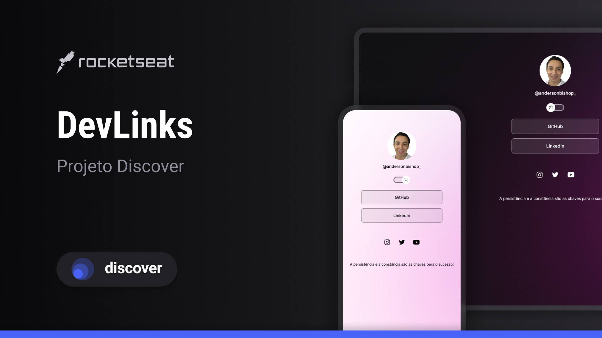

  

<h1 align="center"> Discover - DevLinks </h1>

---
## :rocket: Sobre o repositório

Programa exclusivo e gratuito, promovido pela Rocketseat para ensino de tecnologias WEB.

 

---

## 🚀 Tecnologias

Esse projeto foi desenvolvido com as seguintes tecnologias:

- HTML e CSS
- JavaScript
- Git e Github
- Figma

---

## 💻 Projeto

O DevLinks é um agregador de links para usar como cartão de visitas online.

- [Acesse o projeto finalizado, online](https://andersonsbispo.github.io/dev-links/)

---

## :memo: Licença

Esse projeto está sob a licença MIT. Veja o arquivo [LICENSE](LICENSE) para mais detalhes.

---

    
Feito com ❤️ por [Anderson](https://twitter.com/andersonbishop_) :wave: [Entre em contato!](https://www.linkedin.com/in/andersonsbispo/)

